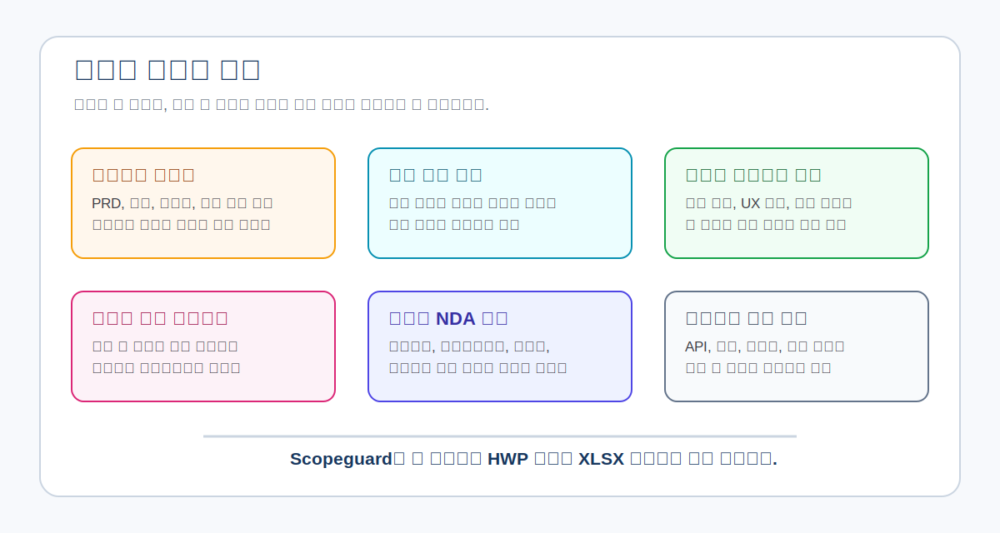
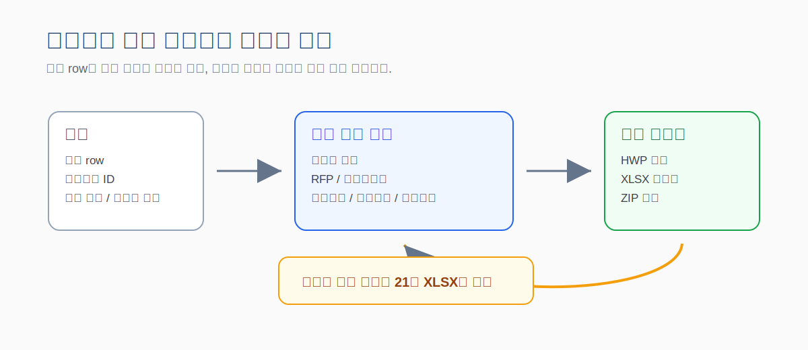
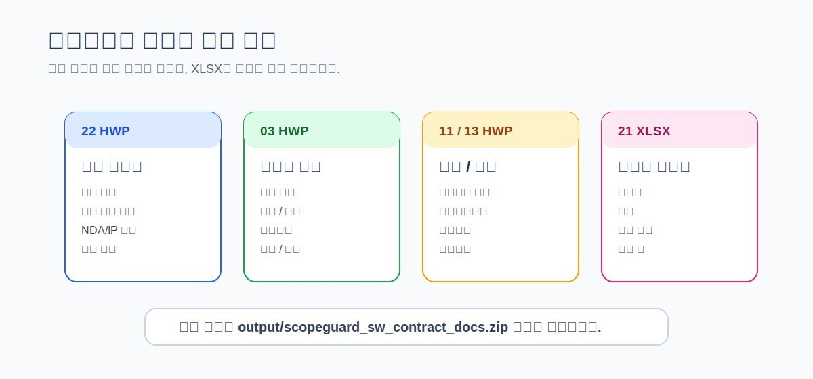

# scopeguard-kr

SW 외주개발계약에서 반복되는 과업범위, 검수, 수정횟수, 변경요청, 회의기록 분쟁을 줄이기 위한 **계약문서 생성기**입니다.

> “누가 이긴다”를 예측하는 도구가 아니라, “이 요청이 하자인지, 무상수정인지, 변경요청인지”를 계약 기준으로 분리하게 만드는 작성기입니다.

`scopeguard-kr`는 견적 row, 전제조건, 완수 조건, 테스트 조건, 부수 항목을 입력받고 그 기준을 계약서 본문, 부속서류, XLSX 체크표에 반영합니다. 법률 자문, 공증, 소송 자동화, 판결 예측을 하지 않습니다.



## At A Glance

| 질문 | 답 |
|---|---|
| 무엇을 만드나 | SW 개발용역 계약서 초안과 부속 DOCX/XLSX 패키지 |
| 누가 쓰나 | 발주자, 수급자, PM, 디자이너, 개발사, 실무 검토자 |
| 핵심 입력은 | 견적 row, 요구사항 ID, 완료 조건, 테스트 조건, 착수자료 상태 |
| 핵심 출력은 | 계약서 초안, 검수기준표, 변경요청서, 수정요청서, 리스크 검토표, 변호사 검토 요청서 |
| 공개 경계는 | 실제 계약 입력값, 업로드 원본, 생성 파일, 환경변수는 저장소에 올리지 않음 |

## How It Works



## Why

개발용역 분쟁은 개발 자체보다 계약 전후 구조가 열려 있어서 커지는 경우가 많습니다.

| 자주 터지는 문제 | 문서로 닫는 방식 |
|---|---|
| PRD, 기능정의서, 화면설계서 없이 착수 | 착수자료 확정표와 기능별 착수 조건 |
| 검수 기준 없이 납품 | 검수기준표와 검수실행 기록표 |
| 하자, 경미한 수정, UX 개선, 신규 기능이 섞임 | 하자신고서, 수정요청서, 변경요청서 분리 |
| 무상수정 횟수와 “수정 1회” 기준이 없음 | 수정횟수 산정표 |
| 구두 요청이 계약 범위처럼 주장됨 | 회의록 승인서와 구두 요청 효력 기준 |
| 대금 지급 조건이 산출물/검수와 끊김 | 대금 마일스톤 지급표 |
| 소스코드와 사전보유자산 귀속이 모호함 | 권리귀속/소스코드 인도목록 |

더 자세한 분쟁 지점은 [`docs/dispute-hotspots.md`](docs/dispute-hotspots.md)에 정리했습니다.

## What It Creates

문서는 성격에 따라 나눕니다. 읽고 승인하는 문서는 DOCX, 행 단위로 확인하는 긴 표는 XLSX를 우선합니다.



| 구분 | 산출물 | 형식 |
|---|---|---|
| 계약 기준 | 계약서 초안, RFP/과업내용서, 입력값 요약표 | DOCX, XLSX |
| 범위·견적 | 견적산정표, 기능별 구현·디자인 명세서, 착수자료 확정표 | DOCX, XLSX |
| 검수·납품 | 검수기준표, 검수실행 기록표, 납품확인서 | DOCX, XLSX |
| 요청 처리 | 수정요청서, 변경요청서, 하자신고서, 회의록 승인서 | DOCX, XLSX |
| 비용·운영 | 대금 마일스톤 지급표, 운영비/API/계정 인수인계서 | DOCX, XLSX |
| 권리·보안 | 권리귀속/소스코드 인도목록, 개인정보/보안 요구사항 | DOCX |
| 합의·리스크 | 공급자/수요자 합의표, 계약서 리스크 검토표 | DOCX, XLSX |
| 선택 별첨 | 디자인/UX 수정범위, 수정횟수 산정표 | DOCX, XLSX |
| 전달·검토 | 변호사 검토 요청서, 계약서 리스크 검토표 | DOCX, XLSX |

기본 샘플 기준 생성 결과:

```text
output/
  변호사_검토_요청서_정리본.hwp
  22_변호사_검토_요청서.docx
  03_SW_개발용역계약서_초안.docx
  04_검수기준표.docx
  15_견적산정표.docx
  18_기능별_구현_디자인_명세서.docx
  19_착수자료_확정표.xlsx
  20_검수실행_기록표.xlsx
  21_계약서_리스크_검토표.xlsx
  scopeguard_lawyer_review_rhwp_package.zip
  scopeguard_sw_contract_docs.zip
```

전체 문서 매트릭스는 [`docs/document-set.md`](docs/document-set.md)에 있습니다.

## Quickstart

```bash
npm run check
npm run audit:publish
npm run build:docs
npm run build:lawyer:hwp
```

입력 파일을 지정할 수도 있습니다.

```bash
node scripts/build-docx-package.mjs --input data/contract-input.sample.json
node scripts/build-docx-package.mjs --input data/contract-input.design.sample.json
node scripts/build-docx-package.mjs --input data/contract-input.ops.sample.json
```

변호사에게 바로 보낼 정리본은 로컬 `rhwp` 저장소를 사용해 HWP로 생성합니다. 기본 경로는 `../rhwp`이며, 다른 위치에 있으면 `RHWP_REPO`로 지정합니다.

```bash
RHWP_REPO=/path/to/rhwp npm run build:lawyer:hwp
```

정적 웹 입력 화면은 아래 명령으로 확인합니다.

```bash
npm run dev
```

브라우저에서 `http://localhost:4173`을 엽니다.

## Core Inputs

### 1. 견적 Row

핵심 입력 단위는 견적 row입니다. 금액만 넣는 견적서가 아니라, “이 금액이 어떤 조건에서 유효한지”를 같이 잠그는 구조입니다.

| 필드 | 의미 |
|---|---|
| `id` | 견적 항목 ID |
| `item` | 작업 항목명 |
| `linkedRequirementIds` | 연결 요구사항 또는 기능 ID |
| `unit` | 시간, 반일, 일, 건, 화면, 기능 등 |
| `quantity` | 산정 수량 |
| `unitPrice` | 단가 |
| `amount` | 금액 |
| `preconditions` | 해당 금액이 유지되는 전제조건 |
| `completionCondition` | 완료로 볼 조건 |
| `testCondition` | 검수 때 확인할 테스트 조건 |
| `subItems` | row 안에 포함되는 세부 작업 |
| `disputeReduced` | 이 row가 줄이는 분쟁 유형 |

이 row는 계약서, RFP, 검수기준표, 대금표, 견적산정표에 같이 반영됩니다.

### 2. 기능별 구현·디자인 명세

기능별 구현·디자인 명세는 `featureSpecs`로 입력합니다.

| 필드 | 의미 |
|---|---|
| `entryPoints` | 화면, 버튼, URL, 메뉴, 알림 등 기능 진입 경로 |
| `designRequirements` | 디자인 기준 충족 여부와 판단 기준 |
| `flow` | Mermaid 원문 기반 디자인 플로우 |
| `flowSvg` | 필요 시 첨부하는 SVG 렌더링 결과 |
| `finalScreens` | 최종 화면 또는 상태 |
| `finalResults` | 저장, 이동, 알림, 데이터 변경 등 최종 결과 |
| `completionCondition` | 완료로 볼 조건 |
| `testCondition` | 검수 때 확인할 테스트 조건 |

## Skill First

초기 사용 흐름은 웹앱보다 Claude/Codex Skill 형태를 우선합니다.

| 위치 | 역할 |
|---|---|
| `.claude/skills/sw-contract-scopeguard/SKILL.md` | Claude용 최상단 orchestrator skill |
| `.codex/skills/sw-contract-scopeguard/SKILL.md` | Codex용 최상단 orchestrator skill |
| `references/documents/index.md` | 문서별 recipe module 라우팅 |
| `references/documents/{문서번호-이름}/recipe.md` | 각 문서의 입력, 출력, 검증 기준 |

웹앱은 입력 보조 화면입니다. 최종 계약 문구 확정이나 법률 판단을 대신하지 않습니다.

스킬 입증 기준은 [`docs/skill-proof.md`](docs/skill-proof.md)에 있습니다.

## Verification

공개 전에는 반드시 아래 명령을 실행합니다.

```bash
npm run audit:publish
```

이 명령은 다음을 확인합니다.

| 검증 | 내용 |
|---|---|
| 문법 | JS/MJS 생성기 문법 검사 |
| 샘플 JSON | 공개 샘플 3종 파싱 |
| DOCX/XLSX 생성 | 샘플별 문서 수와 압축 무결성 검사 |
| 선택 별첨 | 디자인/UX, 수정횟수 별첨 on/off 확인 |
| 견적 연결 | 견적 row ID가 핵심 문서에 반영되는지 확인 |
| 필수 내용 | 각 문서와 workbook의 필수 문구 확인 |
| 공개 경계 | 민감 문자열과 ignore 경계 확인 |
| 스킬 구조 | orchestrator와 문서별 recipe module 존재 확인 |

## Project Structure

```text
.github/
  workflows/audit.yml     # 공개 경계와 DOCX/XLSX 생성 audit
  ISSUE_TEMPLATE/         # 공개 이슈 입력 양식
  pull_request_template.md

assets/
  app.js                  # 정적 웹 입력 화면 로직
  styles.css              # 정적 웹 UI

data/
  contract-input.sample.json          # 기본형
  contract-input.design.sample.json   # 디자인/UX 별첨 포함형
  contract-input.ops.sample.json      # 운영/API 인수인계 포함형
  event-schema.sample.json
  question-overlays.sample.json

scripts/
  build-docx-package.mjs  # DOCX/XLSX 패키징과 ZIP 생성
  audit-publish.mjs       # 공개 전 샘플 빌드와 문자열 점검
  check-data.mjs          # 필수 파일 점검
  docx/
    helpers.mjs           # 공통 문단, 표, 값 포맷
    docs/*.mjs            # DOCX별 문서 빌더
  xlsx/
    writer.mjs            # XLSX 패키징
    workbooks/*.mjs       # XLSX별 워크북 빌더

templates/                # 문서/룰셋 초안
docs/                     # PRD, 데이터 모델, 참고문헌, 감사 기록
samples/                  # 계약서 표본
```

## Publish Boundary

GitHub에는 소스, 템플릿, 익명화된 샘플만 올립니다.

| 공개 대상 | 비공개/ignore 대상 |
|---|---|
| `README.md`, `CONTRIBUTING.md`, `LICENSE` | `output/` |
| `.github/` | `private/`, `.private/`, `local/`, `tmp/` |
| `index.html`, `assets/` | `data/contract-input.json` |
| `scripts/`, `templates/`, `docs/` | `data/*.local.json`, `data/*.private.json` |
| `samples/` | `data/uploads/`, `data/raw/` |
| `data/*.sample.json` | `.env*`, `.dev.vars`, `.wrangler/` |
| `.claude/skills/sw-contract-scopeguard/` | 로컬 assistant/runtime state |
| `.codex/skills/sw-contract-scopeguard/` | 업로드 원본 문서, 생성 DOCX/XLSX/ZIP |

자세한 기준은 [`docs/publish-boundary.md`](docs/publish-boundary.md)에 있습니다. 공개 PR은 `npm run audit:publish`를 통과해야 합니다.

## Participation

| 참여자 | 필요한 검토 |
|---|---|
| 변호사 | 하자·무상수정·변경요청·검수·회의록·권리귀속의 경계 |
| 개발사/프리랜서 | 실제로 자주 터지는 요청 유형과 견적 row 구조 |
| 발주자 | 이해하기 쉬운 입력 문항과 검수 기준 |
| 디자이너/PM | 화면설계, 디자인 변경, UX 개선 요청 분류 |
| 문서 자동화 개발자 | DOCX/XLSX/HWPX 생성, JSON Schema, UI 작성 흐름 |

관련 문서:

- [`docs/roadmap.md`](docs/roadmap.md)
- [`docs/dispute-hotspots.md`](docs/dispute-hotspots.md)
- [`docs/lawyer-participation.md`](docs/lawyer-participation.md)
- [`docs/lawyer-review-request.md`](docs/lawyer-review-request.md)
- [`docs/stakeholder-needs.md`](docs/stakeholder-needs.md)
- [`docs/pr-review-checklist.md`](docs/pr-review-checklist.md)

## References

참고문헌은 계약 조항의 판단 근거처럼 쓰지 않고, 사람이 확인할 수 있는 공개 링크 목록으로만 둡니다.

- 공정거래위원회/한국공정거래조정원 분쟁조정 사례
- 소프트웨어사업 계약 및 관리감독에 관한 지침
- 조달청 e-발주시스템/RFP 작성 구조
- `chrisryugj/korean-law-mcp`: 법제처 API 기반 법령·공개문서·행정규칙 조회
- `chrisryugj/kordoc`: HWP/HWPX/PDF/DOCX/XLSX 문서 파싱·비교·생성

정리된 참고 목록은 [`docs/reference-bibliography.md`](docs/reference-bibliography.md)와 [`docs/legal-mcp-findings.md`](docs/legal-mcp-findings.md)에 있습니다.

외부 실무 글은 공개 참고문헌이나 계약 조항의 출처로 직접 싣지 않습니다. 요구사항 정의, 결과물 형식, 수정 범위, 유지보수 범위, 대금 정산, 업무 범위, 산출물 사용 범위처럼 반복되는 작성 패턴만 제품 문항으로 추상화합니다.

## Review Needed

이 저장소는 법률 자문을 제공하지 않습니다. 아래 항목에 대한 변호사와 실무자의 검토가 필요합니다.

- SW 외주개발계약에서 하자와 변경요청의 경계
- 무상수정 횟수와 통합 수정요청 1회 기준
- 디자인/UX 선호 변경과 검수 반려의 경계
- 대면회의, 구두요청, 회의록 승인 조항
- 검수기준과 승인간주 조항
- 소스코드, 사전보유자산, 오픈소스 권리 귀속
- 개인정보 처리위탁과 운영비/API비 부담 기준
