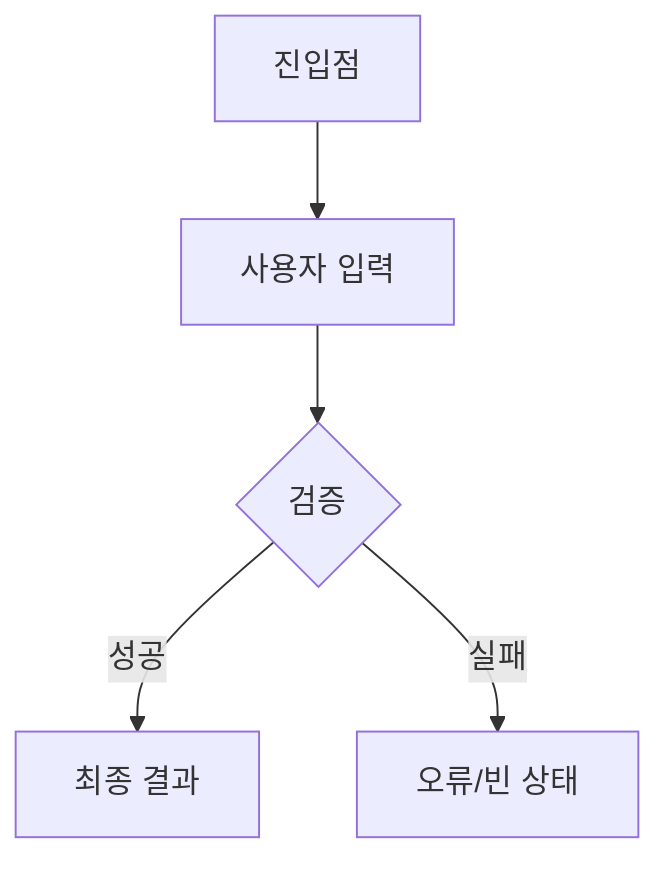

# 기능별 구현·디자인 명세서

본 문서는 기능별 진입점, 디자인 요건 충족 여부, 디자인 플로우, 최종 화면/결과를 RFP·견적 row·검수기준과 연결하기 위한 양식이다. 기능별 기준이 비어 있으면 해당 기능은 개발 착수 전 확인 필요 항목으로 남긴다.

## 1. 작성 원칙

| 항목 | 원칙 |
|---|---|
| 기능 단위 | 요구사항 ID 또는 견적 row와 1:1 또는 N:1로 연결 |
| 진입점 | 사용자가 어디에서 해당 기능을 시작하는지 화면, 버튼, URL, 메뉴, 알림 등으로 표시 |
| 디자인 요건 충족 여부 | 화면설계, 디자인 기준, 상태값, 반응형, 빈 상태, 오류 상태를 충족/미충족/해당 없음으로 표시 |
| 디자인 플로우 | Mermaid 원문을 기준으로 관리하고, SVG는 필요할 때 렌더링 산출물로 첨부 |
| 최종 결과 | 완료 화면, 저장 결과, 알림, 데이터 변경, 관리자 반영 결과를 함께 기재 |

## 2. 기능별 요약

| 기능 ID | 기능명 | 연결 요구사항 | 연결 견적 row | 진입점 | 사용자/권한 | 디자인 요건 충족 여부 | 최종 화면 | 최종 결과 |
|---|---|---|---|---|---|---|---|---|
|  |  |  |  |  |  | 충족 / 미충족 / 해당 없음 |  |  |

## 3. 디자인 플로우

Mermaid 원문을 먼저 작성하고, SVG는 검토용 산출물로 첨부한다.

| 기능 ID | Mermaid 원문 | SVG 첨부 | 검토 메모 |
|---|---|---|---|
|  |  | 필요 시 첨부 |  |

## 4. 화면/결과 검수 연결

| 기능 ID | 화면/상태 | 완료 기준 | 테스트 조건 | 분쟁 예방 메모 |
|---|---|---|---|---|
|  |  |  |  | 진입점, 화면 상태, 완료 결과 불일치 분쟁 축소 |

## 5. 누락 점검

| 점검 항목 | 상태 |
|---|---|
| 기능별 진입점이 지정되었는가 | 충족 / 미충족 / 해당 없음 |
| 디자인 기준과 화면설계가 연결되었는가 | 충족 / 미충족 / 해당 없음 |
| 빈 상태, 오류 상태, 로딩 상태가 정의되었는가 | 충족 / 미충족 / 해당 없음 |
| 최종 화면과 데이터 결과가 구분되었는가 | 충족 / 미충족 / 해당 없음 |
| 검수기준표와 테스트 조건으로 연결되었는가 | 충족 / 미충족 / 해당 없음 |

